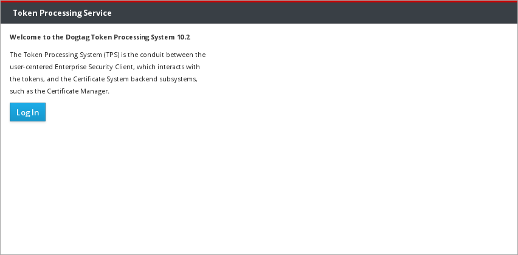
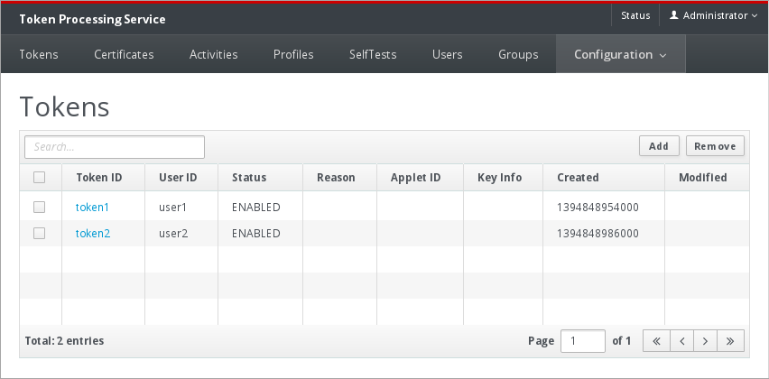

= Authentication =

The TPS UI requires a client certificate authentication. When TPS is installed it will export the TPS admin user certificate and key into a PKCS #12 file. The PKCS #12 file needs to be imported into the browser.

= Login Page =

= Main Page =

= User Guides =

* link:https://www.dogtagpki.org/wiki/TPS_Admin_Guide[TPS Admin Guide]
* link:https://www.dogtagpki.org/wiki/TPS_Agent_Guide[TPS Agent Guide]
* link:https://www.dogtagpki.org/wiki/TPS_Operator_Guide[TPS Operator Guide]
